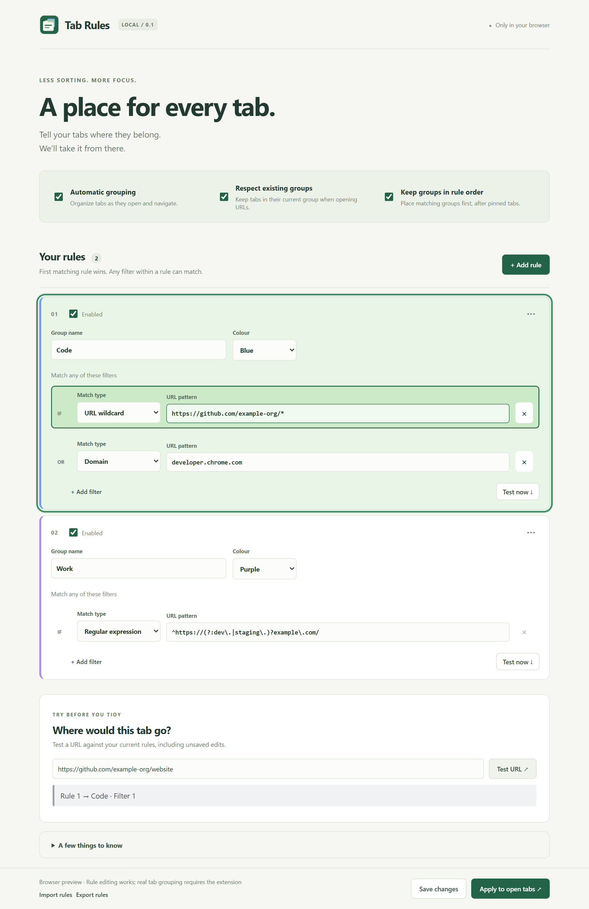

<p align="center"></p>
<h1 align="center">Tab Rules</h1>
<p align="center">A place for every tab. Organize native Chrome tab groups with URL rules.</p>

[](https://github.com/jakobdyrby/tab-rules/actions/workflows/ci.yml)
[](LICENSE)

**Early beta · Chrome 112+ · No account, analytics, or backend.** Not yet published in the Chrome Web Store.


*Editor preview with example rules and a matching URL test.*

## Features

- Match domains, URL wildcards, or regular expressions.
- Combine multiple filters in one group: any filter can match.
- Set group names, colours, and priority; first matching rule wins.
- Preserve existing groups, or let rules regroup tabs and ungroup unmatched tabs.
- Optionally arrange Chrome groups in rule order within each window.
- Test URLs with matching rule/filter highlights and autocomplete from open tabs and recent tests.
- Import and export rules as JSON. All extension data stays on your device.

## Install

### From a release

1. Download `tab-rules-0.1.0.zip` from [Releases](https://github.com/jakobdyrby/tab-rules/releases).
2. Extract it to a permanent folder; keep it there while the extension is installed.
3. Open `chrome://extensions` in Chrome and enable **Developer mode**.
4. Select **Load unpacked** and choose the extracted folder containing `manifest.json`.

### From source

```sh
git clone https://github.com/jakobdyrby/tab-rules.git
cd tab-rules
```

Follow steps 3–4 above, selecting the **extension/** folder. No build or dependency installation is required.

**Upgrading from the old repository layout:** export your rules before removing the old unpacked installation. Load `extension/` and import them into the new installation. Changing the unpacked folder can change its extension ID and storage. Once using `extension/`, update the files and click **Reload** on its Chrome extension card.

## Quick start

1. Open the editor from the extension toolbar icon.
2. Add a **Domain** filter for `github.com`, group name **Code**, and a colour.
3. Save and open a matching URL in an ungrouped tab.
4. Use **Apply to open tabs** to organize existing tabs.

| Match type | Example | Use |
| --- | --- | --- |
| Domain | `github.com` | The hostname and its subdomains |
| URL wildcard | `https://github.com/example-org/*` | A specific organization or route |
| Regex | `^https://(?:dev\.\|staging\.)?example\.com/` | Several related hostnames |

Put specific rules above broader ones using the rule’s **⋯** menu. Add multiple filters to send different sites to the same group.

Read the [behaviour guide](docs/behaviour.md) for group protection, automatic ordering, matching details, and limitations.

## Privacy and permissions

Tab Rules reads tab URLs and titles locally, stores rules and up to 20 recent test URLs, and makes no external requests. It does not read page contents or request browser-history permission. See the [privacy policy](docs/privacy.md) for storage, removal, and permission details.

## Development

Use Node.js 22 or later. No npm dependencies are required.

```sh
npm test
npm run check
npm run package
```

The package command writes `dist/tab-rules-0.1.0.zip`, containing only runtime files with `manifest.json` at its root.

For an editor-only preview:

```sh
python -m http.server 8765 --bind 127.0.0.1 --directory extension
```

Visit `http://127.0.0.1:8765/options.html`. The preview has separate local storage and cannot organize Chrome tabs. Open-tab autocomplete requires the installed extension.

```text
extension/          Load this folder into Chrome
  icons/            Extension and toolbar icons
docs/               Behaviour, privacy, testing, and release guides
scripts/            Validation, packaging, and icon generation
test/               Node tests with simulated Chrome APIs
.github/workflows/  Automated checks and release artifacts
```

## Contributing and support

See [CONTRIBUTING.md](CONTRIBUTING.md). Report problems through [GitHub Issues](https://github.com/jakobdyrby/tab-rules/issues), using sanitized URLs and patterns. Please do not upload browsing history, credentials, or private rule exports.

## Release status

This is an early beta. Automated tests cover core logic; broad live Chrome testing is still in progress. See the [manual test checklist](docs/testing.md), [changelog](CHANGELOG.md), and [release guide](docs/releasing.md).

## License

[MIT](LICENSE) © 2026 Jakob Dyrby.
